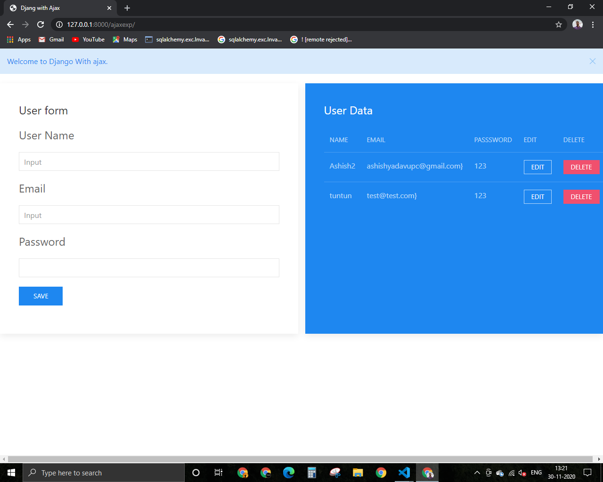

# Django with ajax
# Intoduction
This is **CURD** base project. It describe haw read, write,update data with ajax request without page reload. Ajax request send to server with jquery and perform operation in python code on server side. or return response in **json** formate. In this project sending request with jquery function on generting event. or handle response in jquery function. so it is very required use jquery/javascripts.
# Screenshot

# Files/Folder
  * **Settings:** This is the main file of django app. This is contain configuration system like all install app , database, middleware,templates etc.
  * **models:** This is contain blueprint of all database table in python class.This is contain user model.  
  * **urls:** This is contain urls. In this project two urls file root urls or in side shop app urls. Ecah url map with specefic method.
  * **views:** This is contain action of method that are contain urls file.
  * **admin:** Django provide default admin page so it is required to register this models inside admin file or also provide features to filter,search, show coloum ect.
  * __init__: It is describe it is a python package.
  * **Pycache:** This is contain byte code after complitation of python code.
  * **migration folder:** This is contain blueprint of table in code formate after migrate command it is apply on actual database table.

  * **template:** This is contain html page like ajax.html, home.html .

    * **ajax.html:** This is contain ajax related code that send or handle response.
    * **home.html:** This is home page that include ajax.html inside home.html.

  * **manage:** Django's command-line utility for administrative tasks. runserver, makemigration, migrate, createsuperuser etc.  
